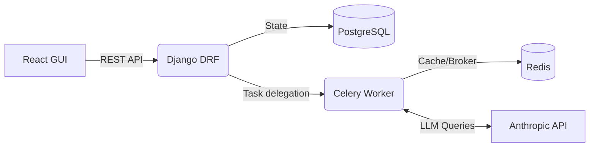

<div align="center">

```text
  _   _                       ____  __  __ 
 | \ | | _____  ___   _ ___  |  _ \|  \/  |
 |  \| |/ _ \ \/ / | | / __| | |_) | |\/| |
 | |\  |  __/>  <| |_| \__ \_|  __/| |  | |
 |_| \_|\___/_/\_\\__,_|___(_)_|   |_|  |_|
  v0.1.0 — Agile Platform with AI Scrum Master
```

**An intelligent Kanban system that generates backlogs, detects bottlenecks, and orchestrates sprints via Natural Language.**

[Features](#-features) • [Quickstart](#-quickstart) • [Architecture](#-architecture) • [AI Agent](#-ai-scrum-master)

</div>

---

## ⚡ What is Nexus-PM?

`Nexus-PM` is a complete project management web application built to mirror tools like Jira, but engineered from the ground up for the AI era. 

Instead of writing tickets manually, a built-in AI Scrum Master converts vague requirements into structured user stories, prioritizes your backlog, and provides insights during sprints.

**One platform. Complete Agile lifecycle. Fully AI-assisted.**

## ✨ Features

- 🤖 **AI Scrum Master:** Auto-generates backlogs from simple prompts and suggests sprint priorities.
- 📋 **Intelligent Kanban:** Fully interactive Board with Drag & Drop, WIP limits, and visual bottlenecks.
- 🧠 **Contextual Chat:** Talk to an AI that knows your active sprint, team velocity, and task statuses.
- 📊 **Real-time Reports:** Velocity charts, daily burndowns, and automated sprint retrospectives.
- 🎨 **Premium UI/UX:** Built with a beautiful dark-mode "Command Center" aesthetic using React & Tailwind.

---

## 🚀 Quickstart (Development)

### 1. Requirements
- Node.js 18+
- Python 3.10+
- PostgreSQL & Redis
- Anthropic API Key (for Claude 3)

### 2. Setup Backend (Django)
```bash
git clone https://github.com/Nitram2704/Nexus-PM.git
cd Nexus-PM/backend
python -m venv venv
# Linux/Mac: source venv/bin/activate
# Windows: venv\Scripts\activate
pip install -r requirements.txt
python manage.py migrate
python manage.py seed_demo
python manage.py runserver
```

### 3. Setup Frontend (React)
```bash
cd ../frontend
npm install
npm run dev
```

### 4. Setup AI Workers (Celery)
```bash
# In a new terminal, from the backend directory:
celery -A nexuspm worker -l info -P eventlet
```

🎉 **Done!** Open `http://localhost:5173` to access the Command Center.

---

## 🏗️ Architecture Under the Hood



Nexus-PM ensures that the UI remains fast and responsive by offloading heavy AI generation tasks (like parsing a whole backlog) to asynchronous Celery workers. The frontend polls for job completion and smoothly animates the new cards into view.

---

<div align="center">
  <i>Built for Modern Agile Teams. Powered by AI.</i>
</div>
