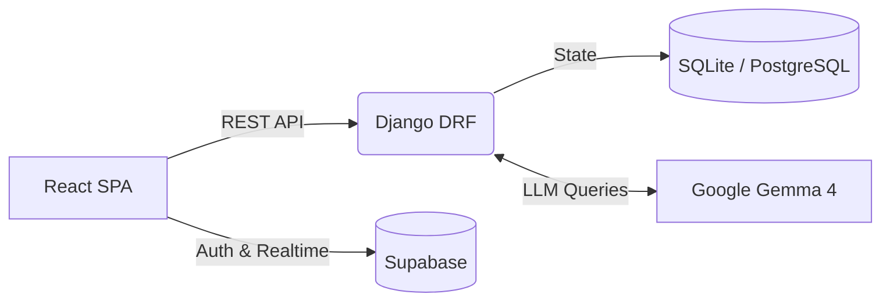

<div align="center">

```text
  _   _                       ____  __  __ 
 | \ | | _____  ___   _ ___  |  _ \|  \/  |
 |  \| |/ _ \ \/ / | | / __| | |_) | |\/| |
 | |\  |  __/>  <| |_| \__ \_|  __/| |  | |
 |_| \_|\___/_/\_\\__,_|___(_)_|   |_|  |_|
  v0.2.0 — Agile Platform with AI Scrum Master
```

**An intelligent project management system that generates backlogs, creates user stories, and orchestrates sprints via Natural Language.**

[Features](#-features) • [Quickstart](#-quickstart) • [Tech Stack](#-tech-stack) • [Architecture](#-architecture) • [Project Structure](#-project-structure)

</div>

---

## ⚡ What is Nexus-PM?

`Nexus-PM` is a full-stack project management web application built to mirror tools like Jira, but engineered from the ground up for the AI era.

Instead of writing tickets manually, a built-in **AI Scrum Master** (powered by Google Gemma 4) converts vague requirements into structured backlogs and user stories, prioritizes your tasks, and provides sprint insights — all through natural language.

**One platform. Complete Agile lifecycle. Fully AI-assisted.**

## ✨ Features

- 🤖 **AI Backlog Generator:** Describe your project in plain language — the AI generates a complete backlog organized by epics.
- 📝 **AI User Stories:** Auto-generates structured User Stories with roles, actions, benefits, and acceptance criteria.
- 📋 **Interactive Kanban Board:** Fully functional Board with Drag & Drop, customizable columns, and task ordering.
- 📊 **Insights Dashboard:** Burn Rhythm, Team Capacity, Risk Alerts, and Backlog Health in a single-screen Smart Hub.
- 🗂️ **Backlog Management:** Sprint planning view with task filtering, bulk actions, and sprint assignment.
- 🏠 **Personal Dashboard:** Centralized home with assigned tasks and recent activity across all projects.
- 🔐 **Complete Auth System:** Registration, login with rate limiting, password reset via email, and JWT token management.
- 🎨 **Tactical Cyber UI:** Dark-mode "Command Center" aesthetic — Midnight Void & Cyan palette, mono-spaced typography, zero border-radius.

---

## 🚀 Quickstart (Development)

### 1. Requirements

- Node.js 18+
- Python 3.10+
- SQLite (default) or PostgreSQL
- Google API Key (for Gemma 4 AI features, optional — falls back to mock data)

### 2. Setup Backend (Django)

```bash
git clone https://github.com/Nitram2704/Nexus-PM.git
cd Nexus-PM/backend
python -m venv venv
# Linux/Mac: source venv/bin/activate
# Windows: venv\Scripts\activate
pip install -r requirements.txt
```

Create a `.env` file in the `backend/` directory:

```env
SECRET_KEY=your-secret-key
DEBUG=True
ALLOWED_HOSTS=localhost,127.0.0.1
GOOGLE_API_KEY=your-google-api-key   # optional, mock mode if omitted
```

Run migrations and start the server:

```bash
python manage.py migrate
python manage.py runserver
```

### 3. Setup Frontend (React + Vite)

```bash
cd ../frontend
npm install
npm run dev
```

### 4. Environment Variables

Create a `.env` file in the `frontend/` directory:

```env
VITE_SUPABASE_URL=your-supabase-url
VITE_SUPABASE_ANON_KEY=your-supabase-anon-key
```

🎉 **Done!** Open `http://localhost:5173` to access the Command Center.

---

## 🛠️ Tech Stack

### Frontend

| Technology | Version | Purpose |
|---|---|---|
| React | 19 | UI library |
| TypeScript | 6 | Type safety |
| Vite | 8 | Build tool & dev server |
| Tailwind CSS | 4 | Utility-first styling |
| Zustand | 5 | Global state management |
| TanStack Query | 5 | Server state & caching |
| React Router | 7 | Client-side routing |
| Recharts | 3 | Data visualization |
| @hello-pangea/dnd | 18 | Drag & Drop (Kanban) |
| Lucide React | — | Icon system |

### Backend

| Technology | Version | Purpose |
|---|---|---|
| Django | 5.1 | Web framework |
| Django REST Framework | 3.15 | REST API |
| SimpleJWT | 5.3 | JWT authentication |
| django-cors-headers | 4.4 | CORS handling |
| python-decouple | 3.8 | Environment config |
| google-generativeai | — | Gemma 4 AI integration |

### Infrastructure

| Service | Purpose |
|---|---|
| Supabase | Auth & real-time database |
| SQLite / PostgreSQL | Primary data store |
| Google AI (Gemma 4) | Backlog & User Story generation |

---

## 🏗️ Architecture


```mermaid
graph LR
    A[React SPA] -->|REST API| B(Django DRF)
    A -->|Auth & Realtime| S[(Supabase)]
    B -->|State| C[(SQLite / PostgreSQL)]
    B <-->|LLM Queries| F[Google Gemma 4]
```

The frontend communicates with the Django backend via REST API for all project, task, and sprint operations. AI features (backlog generation, user story creation) are processed synchronously through the Google Generative AI SDK, with automatic fallback to mock data when no API key is configured. Supabase handles supplementary auth and real-time capabilities on the client side.

---

## 📁 Project Structure

```
Nexus-PM/
├── backend/
│   ├── apps/
│   │   ├── accounts/      # Custom User model, JWT auth, login rate limiting
│   │   ├── intelligence/   # AI client (Gemma 4), backlog & story generation
│   │   ├── projects/       # Projects, Members, Columns (Kanban), permissions
│   │   └── tasks/          # Tasks, Sprints, Comments, ordering
│   ├── nexus/              # Django settings, root URLs, WSGI
│   ├── requirements.txt
│   └── manage.py
├── frontend/
│   ├── src/
│   │   ├── api/            # Axios API modules (auth, tasks, projects, ai, etc.)
│   │   ├── components/
│   │   │   ├── ai/         # BacklogGenerator (AI prompt → backlog)
│   │   │   ├── kanban/     # AISuggestionModal, TaskDetailDrawer, ColumnMenu
│   │   │   └── layout/     # MainLayout, Navbar (breadcrumbs & tabs)
│   │   ├── pages/          # Dashboard, Kanban, Backlog, Insights, Auth pages
│   │   ├── store/          # Zustand stores (auth, project)
│   │   └── types/          # TypeScript interfaces (auth, project)
│   ├── package.json
│   └── vite.config.ts
├── design-system/          # UI/UX design tokens & guidelines
├── docs/                   # Architecture plans & session notes
└── README.md
```

---

## 🧠 AI Scrum Master

The intelligence module uses **Google Gemma 4 (26B)** to power two core features:

| Feature | Endpoint | Description |
|---|---|---|
| **Generate Backlog** | `POST /api/v1/ai/{project}/generate/` | Takes a project description and returns a structured backlog organized by epics |
| **Generate User Stories** | `POST /api/v1/ai/{project}/generate-stories/` | Takes a requirement and returns User Stories in the "As a…, I want…, so that…" format |
| **Import Proposal** | `POST /api/v1/ai/{project}/proposals/{id}/import/` | Imports selected AI-generated items as real tasks into the project |

All AI features include automatic **mock fallback** — if no Google API key is configured, the system returns sample data so the platform remains fully usable for development and demos.

---

## 📄 API Endpoints

### Auth (`/api/auth/`)

| Method | Endpoint | Description |
|---|---|---|
| POST | `/register/` | Create new account |
| POST | `/login/` | Login with rate limiting |
| POST | `/refresh/` | Refresh JWT token |
| GET | `/me/` | Get current user profile |
| GET | `/dashboard/` | Personal dashboard data |
| POST | `/password-reset/` | Request password reset email |
| POST | `/password-reset-confirm/<uid>/<token>/` | Confirm password reset |

### Projects & Tasks (`/api/v1/`)

| Method | Endpoint | Description |
|---|---|---|
| GET/POST | `/projects/` | List / create projects |
| GET/PATCH/DELETE | `/projects/<id>/` | Project detail ops |
| GET/POST | `/projects/<id>/columns/` | Manage Kanban columns |
| GET/POST | `/projects/<id>/tasks/` | List / create tasks |
| PATCH | `/tasks/<id>/` | Update task (move, assign, edit) |
| GET/POST | `/projects/<id>/sprints/` | Manage sprints |

---

<div align="center">
  <i>Built for Modern Agile Teams. Powered by AI.</i>
</div>
